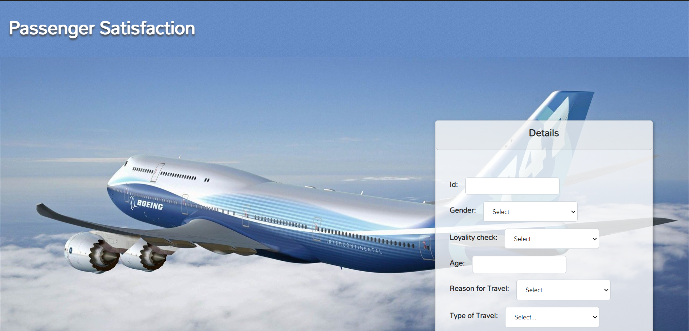

# PASSENGER SATISFACTION

Passenger Satisfaction is a binary classification problem that determines whether a customer is satisfied or not with his/her flight journey, based on 24 different attributes.

* **Technologies Used:** Machine Learning, Python
* **Framework:** Django
* **Frontend:** Html, CSS, JavaScript and JQuery 


Detailed explanation of Machine Learning aspects of this project: [Medium blog](https://shiva1gandluri.medium.com/passenger-satisfaction-f213ec5cc9f7)

### Project Demo

 > *Click on the image below to go to the project demo.*

 > [](https://www.youtube.com/watch?v=4v2mJSBRhnY)

### Table of Contents

* [Versions](#versions)
* [Terminal Commands](#terminal-commands)
* [File Structure](#file-structure)
* [Find me](#find-me)


### Versions

* python : 3.6.5
* Django : 3.2
* scikit-learn :  0.19.1
* Bootstrap : 4.0


### Terminal Commands

1. Open Terminal
2. Install Python and necessary libraries (joblib, pandas, scikit learn and bootstrap modal forms)
3. Install Django as mentioned in [Django Official Page](https://www.djangoproject.com/download/).
4. Go to your virtual environment project by running the command in terminal: ```workon your_virtualenv_name```
5. Run in terminal: ```python ./manage.py runserver```
6. Navigate to: [http://127.0.0.1:8000/](http://127.0.0.1:8000/)

### File Structure

Within the download you'll find the following directories and files:

```
passenger-satisfaction
├── .vscode
│   └── settings.json
├── feedback
│   ├── __pycache__
│   │   ├── __init__.cpython-36.pyc
│   │   ├── admin.cpython-36.pyc
│   │   ├── apps.cpython-36.pyc
│   │   ├── models.cpython-36.pyc
│   │   └── views.cpython-36.pyc
│   ├── migrations
│   │   ├── __pycache__
│   │   │   ├── __init__.cpython-36.pyc
│   │   └── __init__.py 
│   ├── __init__.py
│   ├── admin.py
│   ├── apps.py
│   ├── models.py
│   ├── tests.py
│   └── views.py
├── ml_model
│   ├── __pycache__
│   │   └── py_functions.cpython-36.pyc
│   ├── finalized_model_satisfaction.sav
│   ├── model.py
│   ├── py_functions.py
│   └──  satisfaction_2015.csv
├── passenger_satisfaction
│   ├── __pycache__
│   │   ├── __init__.cpython-36.pyc
│   │   ├── settings.cpython-36.pyc
│   │   ├── urls.cpython-36.pyc
│   │   └── wsgi.cpython-36.pyc
│   ├── __init__.py
│   ├── asgi.py
│   ├── settings.py
│   ├── urls.py
│   └── wsgi.py
├── static
│   ├── fonts
│   │   └── Mallanna.css
│   ├── gifs
│   │   ├── sorry_milk.gif
│   │   └── thankyou_milk.gif
│   ├── images
│   │   ├── Passenger_Satisfaction_Thumbnail.PNG
│   │   ├── aeroplane_1.jpg
│   │   └── aeroplane_8.jpg
│   ├── bootstrap_4.css
│   ├── bootstrap_edited.css
│   └── styles.css
├── templates
│   ├── feedback
│   │   └── index.html
│   ├── fonts.css
├── README.md
├── finalized_model_satisfaction.sav
├── manage.py
└── passenger_satisfaction-checkpoint.ipynb
```

### Find me

LinkedIn : https://www.linkedin.com/in/shiva-gandluri-63016416b/
Youtube : https://www.youtube.com/channel/UC_vlvekR9zdzK0nG2bXvkKQ
